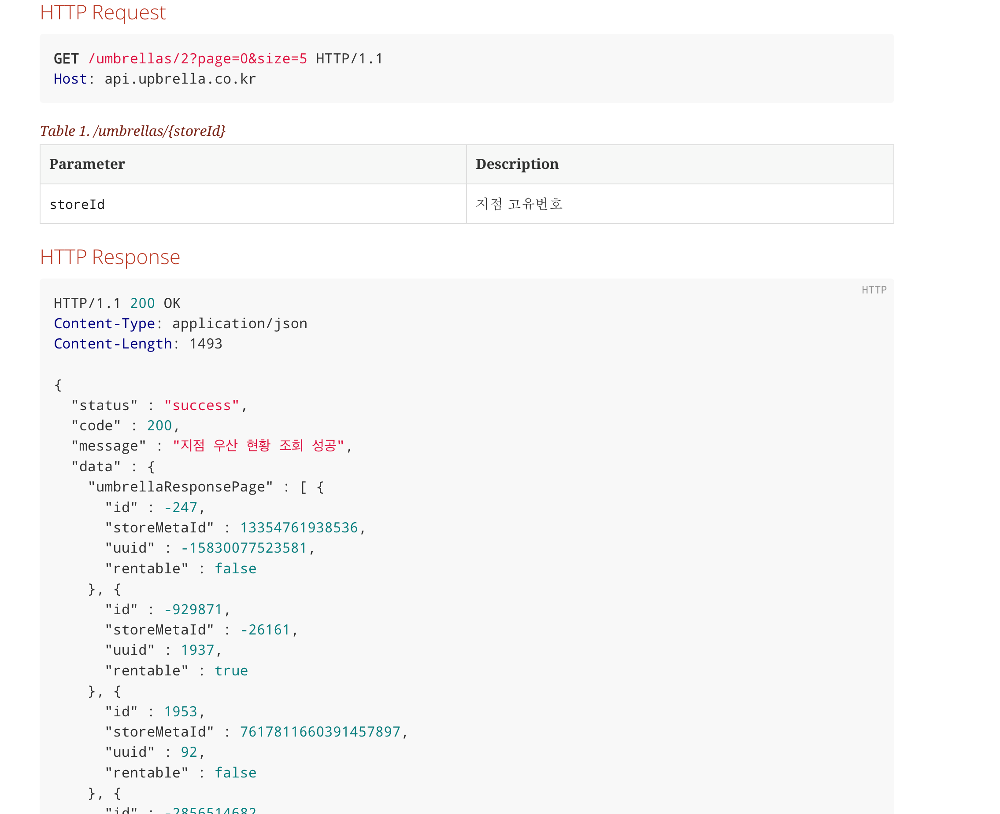

안녕하세요,
저는 업브렐라에서 백엔드 개발을 담당하고 있습니다.
업브렐라의 테스트 코드를 작성하면서 드러났던 문제점과 이를 Fixture Monkey라는 오픈소스 라이브러리로 어떻게 개선했는지 적어보려합니다.

## 기존 방식의 문제점

단순한 API에서는 괜찮았지만, 여러 테이블과 얽힌 복잡한 API의 경우 테스트 코드 작성에 점점 많은 시간을 소요하게 되었습니다. 이 중 꽤 많은 비중을 테스트 검증을 위한 Mock 객체 작성이 차지했습니다.

저희 팀은 Service Layer와 Controller Layer 테스트를 BDDMockito를 이용해서 BDD(Behavior Driven Development) 방식의 테스트를 진행했습니다.

기존의 방식에서는 객체가 복잡해질수록 Given - When - Then 중 Given이 차지하는 비중이 높아졌고, 이에 따라 가독성도 안좋아졌습니다.
뿐만 아니라, 단순히 값을 대입해 객체를 생성하다보니, 테스트 코드에서 값을 변경해야하는 경우 수정해야할 부분이 많아 불편했습니다.
다른 문제점은 객체와 객체 간의 관계가 값으로 대입하다보니 긴 코드로에서 잘 드러나지 않았다는 점입니다.

### 1. 단순 반복의 객체 생성 코드, 가독성 저하


```agsl
@BeforeEach
    void setUp() {
        rentUmbrellaByUserRequest = RentUmbrellaByUserRequest.builder()
                .region("신촌")
                .storeId(25L)
                .umbrellaId(99L)
                .conditionReport("상태 양호")
                .build();

        foundStoreMeta = StoreMeta.builder()
                .id(25L)
                .name("motive study cafe")
                .deleted(false)
                .build();

        foundUmbrella = Umbrella.builder()
                .id(99L)
                .uuid(99L)
                .deleted(false)
                .storeMeta(foundStoreMeta)
                .rentable(true)
                .build();

        userToRent = User.builder()
                .id(11L)
                .name("테스터")
                .phoneNumber("010-1234-5678")
                .adminStatus(false)
                .build();

        history = History.builder()
                .id(33L)
                .rentedAt(LocalDateTime.of(1000, 12, 3, 4, 24))
                .returnedAt(LocalDateTime.of(1000, 12, 3, 4, 25))
                .refundedAt(LocalDateTime.of(1000, 12, 3, 4, 26))
                .refundedBy(userToRent)
                .returnStoreMeta(foundStoreMeta)
                .umbrella(foundUmbrella)
                .user(userToRent)
                .rentStoreMeta(foundStoreMeta)
                .build();


    }
```

### 2. 다양한 객체 생성의 어려움

객체 생성이 반복되다보니 자연스럽게 페이징 API와 같이 목록을 조회하는 경우 풍부한 데이터를 넣기 어려워졌습니다. 
아래는 협업 지점 목록을 조회하는 API에서 객체를 생성하던 코드입니다.

```agsl
StoreMeta storeIn = StoreMeta.builder()
                    .id(1)
                    .name("모티브 카페 신촌 지점")
                    .activated(true)
                    .deleted(false)
                    .latitude(4)
                    .longitude(3)
                    .businessHours(businessHours)
                    .build();

            StoreMeta storeOff = StoreMeta.builder()
                    .id(1)
                    .name("모티브 카페 공사 중")
                    .activated(false)
                    .deleted(false)
                    .latitude(4)
                    .longitude(3)
                    .businessHours(businessHours)
                    .build();
            
            storeMetaList.add(storeIn);
            storeMetaList.add(storeOff);
```

이처럼 다양한 객체를 생성하는 것은 테스트 코드 작성에 많은 시간을 소요하게 만들고, 상대적으로 적은 데이터로 API 명세를 만들게 되었습니다.


### 3. 엣지 케이스 발견

테스트 코드를 작성하면서 엣지 케이스를 발견하고, 이를 수정하는 과정에서 테스트 코드를 수정해야하는 경우가 많습니다.
혹은, 엣지 케이스를 찾기 위해 다양한 테스트 객체를 생성해야하는 필요성도 있습니다.

간단한 예를 들면, 두 숫자를 더할 때 오버플로우가 발생하는 엣지 케이스를 생각해보겠습니다.

```agsl
    @Test
    @DisplayName("테스트")
    void test() {
        // given
        int a = 2147483647;
        int b = 1;
        
        // when
        int result = a + b;
        
        // then
        assertThat(result).isEqualTo(-2147483648);
    }
```

객체 간의 관계에서 엣지 케이스에서 발생할 수 있는 예외를 찾기 위해서는 다양한 값으로 객체를 만들어 테스트해보아야합니다.
그러나, 위처럼 복잡한 객체를 생성하는 것은 테스트 코드 작성에 많은 시간을 소요하게 만들고, 테스트 코드의 가독성을 떨어뜨리게 됩니다.

그리고, 위 문제들과 연결해서 다양한 객체를 생성하다보니 반복되는 객체 생성 코드가 많아집니다. 
객체 생성 로직을 분리하고, 재사용성을 높여 반복적으로 다양한 케이스를 테스트하게 할 수 없을까요?

이러한 문제점들을 해결하기 위해서 네이버에서 공개한 오픈소스 라이브러리가 바로 Fixture Monkey입니다.
다음으로 Fixture Monkey가 어떻게 문제점을 해결했는지 알아보겠습니다.

## Fixture Monkey 활용기

[Fixture Monkey](https://naver.github.io/fixture-monkey/kr/)의 특징은 다음과 같습니다.

1. 재사용성 : 복잡한 스펙의 테스트 객체를 재사용할 수 있습니다.
테스트마다 복잡한 객체를 매번 정의할 필요 없습니다.

2. 반복성 : 테스트마다 새로운 객체를 자동으로 생성해서 테스트할 수 있습니다.

3. 간단함 : 빌더 패턴으로 복잡한 테스트 객체를 정의할 수 있습니다.
테스트 객체 내 복잡한 연관관계도 쉽게 처리할 수 있습니다.

### 0. 시작하기

#### 0.1. 의존성 추가

```agsl
testImplementation("com.navercorp.fixturemonkey:fixture-monkey-starter:0.5.0")
```

#### 0.2. Lombok을 사용하는 Java

Upbrella는 객체 생성을 Lombok을 사용한 Builder 패턴을 이용해서 처리하고 있습니다.
Fixture Monkey가 Lombok, Builder 환경에서도 잘 작동하도록 하기 위해서는 다음과 같이 설정해야합니다.

```agsl
private static final FixtureMonkey fixtureMonkey = FixtureMonkey.builder()
            .objectIntrospector(BuilderArbitraryIntrospector.INSTANCE)
            .defaultNotNull(true)
            .build();
```

Builder가 아닌 다른 패턴을 사용하는 경우에도 objectIntrospector 옵션을 변경하여 사용할 수 있습니다.

#### 0.3 객체 생성하기

여기까지만 설정해도 fixtureMonkey를 사용할 수 있습니다.
fixtureMonkey를 사용해서 객체를 생성하는 방법은 다음과 같습니다.

```agsl
// 기본 객체 생성
StoreMeta storeMeta = fixtureMonkey.giveMeOne(StoreMeta.class);

// Builder를 통해서 객체 생성
storeMeta = fixtureMonkey.giveMeBuilder(StoreMeta.class)
                        .set("id", 1L)
                        .sample();
```
이렇게 생성했을 때, 제약조건이 없다면 random으로 값이 입력됩니다. 
여기에서 두 가지 문제가 발생했습니다.
제약 조건이 존재하는 필드인데도 제약 조건을 넣지 않으면 모든 가능한 랜덤 값이 입력되어 테스트가 실패하는 경우입니다.
따라서 이러한 경우에는 제약조건을 지정해주어야합니다.

두번째로, 업브렐라는 API 명세로 RestDocs를 사용하는데요, Integer, Long의 Random 값이 입력될 때 너무 큰 값, 혹은 음수가 입력되어 가독성이 저하된다는 문제가 있었습니다.

String의 경우도 읽을 수 없는 문자가 삽입되어 보기 좋지 않았습니다.

<p align="center"></p>

#### 0.3. 기본 객체 빌더 정의하기

따라서, 이러한 문제를 해결하기 위해서는 다음과 같이 제약조건을 지정해주어야합니다.

```agsl
// 적절한 범위의 Long 값 생성
public static long buildLong() {

        return Randoms.nextInt(10000);
    }

public static ArbitraryBuilder<UmbrellaRequest> builderUmbrellaRequest() {

        return fixtureMonkey.giveMeBuilder(UmbrellaRequest.class)
                .set("storeMetaId", buildLong())
                .set("uuid", buildLong());
    }
```

그리고 위의 코드처럼, 객체별로 ArbitraryBuilder를 반환하는 메서드를 Factory Class로 분리하였습니다.
이렇게 했을 때, 중복되는 코드 없이 재사용성을 높일 수 있습니다. 
기존의 코드에서는 객체 간의 관계가 바뀌는 경우에 객체를 새로 생성해야했는데요, 위 방식에서는 기본 Builder의 제약조건에서 추가로 변경이 필요한 값을 그때그때 수정하여 사용할 수 있으므로 재사용성이 높았습니다.

마지막으로, String의 의미없는 값을 RestDocs에서 의미있는 값에서 골라서 가져오도록, 다음과 같이 정의했습니다.

```agsl
  private static String[] cafeList = {"투썸", "스타벅스", "이디야", "커피빈", "엔젤리너스", "할리스", "탐앤탐스", "커피마마", "커피에반하다", "커피나무"};
  
  private static String pickRandomString(String[] names) {

        return names[buildInteger() % names.length];
    }
  //... 생략
  public static ArbitraryBuilder<StoreMeta> builderStoreMeta() {

        return fixtureMonkey.giveMeBuilder(StoreMeta.class)
                .set("deleted", false)
                .set("id", buildLong())
                .set("name", pickRandomString(cafeList))
                .set("address", pickRandomString(addressList))
                .set("category", pickRandomString(addressList))
                .set("password", String.valueOf(buildInteger()))
                .set("latitude", Arbitraries.doubles().between(1, 100).sample())
                .set("longitude", Arbitraries.doubles().between(1, 100).sample());
    }
```

마지막으로, Fixture Monkey를 도입하면서 개인적으로 장점이라고 느껴졌던 부분을 정리해보았습니다.

### 1. 빠르고 간편한 테스트 코드 작성

테스트 코드와 객체 생성 코드를 쉽게 분리할 수 있습니다. 
객체 생성 코드의 양이 줄어들어 전체적인 가독성이 높아졌습니다.
그리고, 객체 간의 관계가 존재하는 경우, 관계가 테스트 코드 상에서 잘 드러납니다.
아래는 Fixture Monkey를 도입하기 전후의 동일한 테스트 코드의 일부분입니다.

#### Fixture Monkey를 도입하기 전

```agsl
@BeforeEach
        void setUp() {
            storeMeta = StoreMeta.builder()
                    .id(2L)
                    .name("name")
                    .deleted(false)
                    .build();

            umbrellas.add(Umbrella.builder()
                    .id(1L)
                    .uuid(43L)
                    .deleted(false)
                    .storeMeta(storeMeta)
                    .rentable(true)
                    .build());

            umbrellaResponse = UmbrellaResponse.builder()
                    .id(1L)
                    .uuid(43L)
                    .storeMetaId(2L)
                    .rentable(true)
                    .build();
        }
```

#### Fixture Monkey를 도입한 후

```agsl
@BeforeEach
        void setUp() {

            storeMeta = FixtureBuilderFactory.builderStoreMeta().sample();

            for (int i = 0; i < 5; i++) {
                generatedUmbrellas.add(FixtureBuilderFactory.builderUmbrella()
                        .set("storeMeta", storeMeta)
                        .sample());
            }

            expectedUmbrellaResponses = generatedUmbrellas.stream()
                    .map(umbrella -> FixtureFactory.buildUmbrellaResponseWithUmbrellaAndStoreMeta(umbrella, storeMeta))
                    .collect(Collectors.toList());
        }
```

위 코드에서 협업지점을 생성하고, 그 협업지점에 속한 우산들을 생성하고, 그 우산들을 통해 예상되는 응답을 생성하는 코드입니다.
테스트 코드를 읽는 사람은 위 코드를 통해 협업지점과 우산들의 관계를 쉽게 파악할 수 있습니다.

### 2. 풍부한 API 문서

제약 조건을 만족하는 다양한 객체 생성이 쉬워지므로, RestDocs와 연계하여 쉽게 풍부한 API 문서를 만들 수 있습니다.
이를 통해 API 사용자가 손쉽게 이해할 수 있도록 돕습니다.

#### FixtureMonkey와 RestDocs를 활용한 HTTP Response 예시

```agsl
HTTP/1.1 200 OK
Content-Type: application/json
Content-Length: 1414

{
  "status" : "success",
  "code" : 200,
  "message" : "회원 목록 정보 조회 성공",
  "data" : {
    "users" : [ {
      "id" : 9248,
      "socialId" : 6997,
      "name" : "고구마",
      "phoneNumber" : "010-5897-8597",
      "bank" : "제주",
      "accountNumber" : "998-113-100007",
      "adminStatus" : false
    }, {
      "id" : 8744,
      "socialId" : 8956,
      "name" : "귤도라지",
      "phoneNumber" : "010-1041-5563",
      "bank" : "새마을",
      "accountNumber" : "998-183-100066",
      "adminStatus" : true
    }, {
      "id" : 5602,
      "socialId" : 4600,
      "name" : "자두",
      "phoneNumber" : "010-1421-1063",
      "bank" : "광주",
      "accountNumber" : "177-898-101647",
      "adminStatus" : false
    }, {
      "id" : 8478,
      "socialId" : 6259,
      "name" : "무화과",
      "phoneNumber" : "010-2450-1022",
      "bank" : "SC제일",
      "accountNumber" : "244-111-100002",
      "adminStatus" : true
    }, {
      "id" : 987,
      "socialId" : 2008,
      "name" : "사과",
      "phoneNumber" : "010-1068-7783",
      "bank" : "수협",
      "accountNumber" : "128-110-138144",
      "adminStatus" : false
    }, {
      "id" : 5212,
      "socialId" : 2640,
      "name" : "배추",
      "phoneNumber" : "010-1009-2391",
      "bank" : "제주",
      "accountNumber" : "239-128-100002",
      "adminStatus" : true
    } ]
  }
}
```

### 3. Mock 데이터 주입하기

Fixture Monkey를 통해 생성된 객체를 Mock 데이터로 활용할 수 있습니다.
Factory 클래스를 그대로 활용하여 데이터베이스에 Mock data를 insert할 수 있습니다.

그렇지만 한가지 아쉬운 점이 있었는데요,
바로 Fixture Monkey를 도입하기 전보다 테스트 코드의 실행 시간이 늘어난다는 점입니다.

하지만, 테스트 코드의 실행 시간이 늘어난다는 단점은 테스트 코드의 가독성을 높이고, 테스트 코드의 유지보수를 쉽게 해주는 Fixture Monkey의 장점과 비교했을 때, 아직까지는 큰 단점이라고 생각되진 않습니다.
테스트 코드 작성에 많은 시간을 쏟으시는 개발자라면 충분히 도입을 고려할만큼 쉬운 사용성과 편리함, 생산성 향상을 제공하는 라이브러리라고 생각됩니다.


