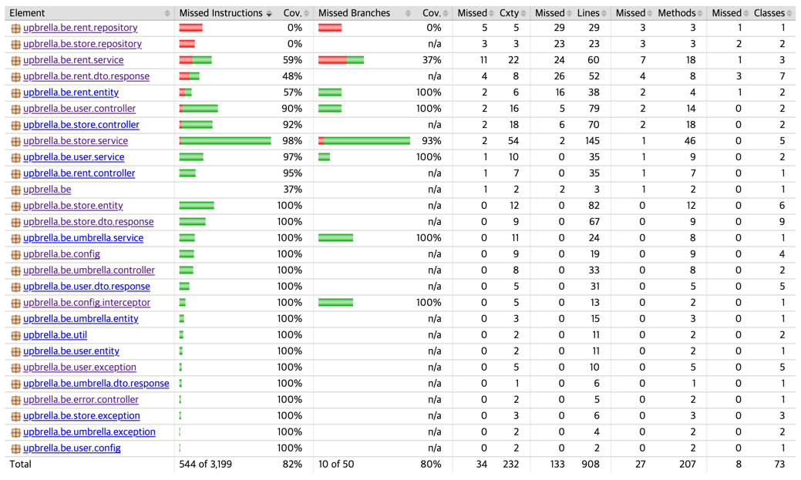
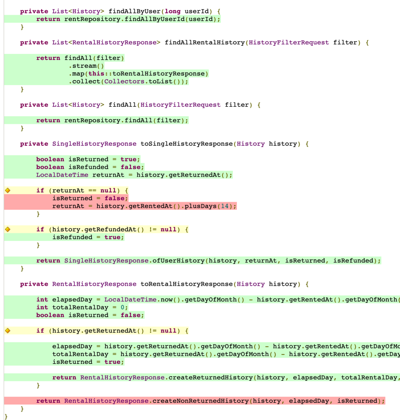

안녕하세요,
저는 업브렐라에서 백엔드 개발을 담당하고 있습니다.
업브렐라의 테스트 코드를 작성하면서 어떻게 하면 더 퀄리티 좋은 테스트 코드를 작성할 수 있을지에 대해 고민했습니다.

토스 팀의 [이응준님의 코드 커버리지 100% 달성하기](https://www.youtube.com/watch?v=jdlBu2vFv58) 영상을 보면서 많은 영감을 얻을 수 있었습니다.
다음은, 영상에 나오는 로버트 마틴의 클린 코더(2016) 책 속 인용구인데요.
저도 이 책을 읽어보지는 못했지만 커버리지의 중요성에 대해 많은 생각을 하게 되었습니다.

```
얼마만큼의 코드를 자동화한 단위 테스트로 커버해야할까?
대답할 필요조차 없다. 모조리 다 해야 한다. 모조리!

100% 테스트 커버리지를 권장하냐고? 권장이 아니라 강력히 요구한다.
작성한 코드는 한 줄도 빠짐없이 전부 테스트해야 한다.
군말은 필요 없다.
```

위 영상처럼 100%에 도달하면 좋겠지만, 현실적으로는 불가능한 일이라고 생각하여, 100%를 추구하는 테스트 코드 작성을 하는 것을 팀 내부의 목표로 잡았습니다.

저희 팀도 Jacoco를 도입하면서 코드 커버리지 측정 및 관리를 시작하였고,
처음 코드 커버리지 측정을 했을 때 불과 50%대에 불과하던 커버리지율을 지금 이 글을 쓰는 순간에는 80% 이상으로 관리하고 있습니다.
최종적으로, 현재는 70% 이상의 테스트 커버리지를 유지하지 못하면 빌드 실패되도록 설정하였습니다.

업브렐라 팀이 왜 테스트 커버리지를 높게 유지하고자 했는지 소개하고자 합니다.

## 1. 문제 정의

팀원들과 프로젝트를 진행하며 공통적으로 테스트 커버리지를 측정하는 도구의 필요성을 느꼈던 순간들이 있습니다.

- **구현한 기능에 대해 바로바로 테스트 코드를 PR하지 못할때가 많다.**
나중에 테스트 코드를 작성하려 하지만, 어느 부분이 작성하지 않은 부분인지 일일히 확인하는 불편함이 있었습니다.

- **테스트 코드를 작성하지만, 테스트 코드가 불안정하다.**
작성한 테스트코드가 어느 범위까지 커버되는지 확신할 수 없었습니다.

- **테스트 코드가 완전하지 못하기 때문에 프로덕션 코드를 수정했을 때 영향에 대해 많이 고민해야한다.**
즉, 자신있게 배포를 할 수 없게 됩니다.

- **불필요한 프로덕션 코드가 많아진다.**
반대로, 커버리지율을 높게 유지하게 된다면 불필요한 코드를 삭제하는게 유지보수가 편하다는 걸 깨닫게 되었습니다.

## 2. 커버리지 관리 도구, Jacoco

### 2.1. 코드 커버리지란?
코드 커버리지란, 테스트 코드가 프로덕션 코드를 커버하는 비율을 의미합니다.
즉, 테스트 코드가 실제 프로덕션 코드를 검증하는 비율을 의미하는데요, 이를 통해 작성된 테스트의 수가 충분한지, 혹은 적절한지 논의할 수 있습니다.

코드 커버리지의 측정 기준에는 여러 가지가 있습니다.
- 클래스 커버리지 : 클래스가 실행되었다면 커버된 것으로 간주
- 메서드 커버리지 : 메서드가 실행되었다면 커버된 것으로 간주
- 라인 커버리지 : 코드의 한 라인이 실행되었다면 커버된 것으로 간주
- 인스트럭션 커버리지 : Instruction 단위 측정
- 브랜치 커버리지 : if, switch문의 분기를 커버하는 비율

그렇지만 코드 커버리지가 높다고 해서 꼭 모든 로직이 잘 테스트되고 있음을 보장하는 것은 아닙니다.
예를 들어, 아래와 같은 코드가 있다고 가정해봅시다.

```java
public class Calculator {
    public int add(int a, int b) {
        return a + b;
    }
}
```

위 코드는 아래와 같이 테스트 코드를 작성할 수 있습니다.

```java
public class CalculatorTest {
    @Test
    public void add() {
        Calculator calculator = new Calculator();
        int result = calculator.add(1, 2);
        assertEquals(3, result);
    }
}
```
위 테스트 코드는 통과할 것이고, 커버리지 100%를 달성하겠지만, 위 코드에서 `a + b`를 `a * b`로 변경해도 여전히 동작할 것입니다.
그러나 테스트에 대입되는 변수를 다양하게 작성했더라면 `+`를 `*`로 변경했을 때 테스트는 통과하지 못했을 것입니다.

즉, 높은 커버리지 비율을 유지하는 것과는 별도로 **좋은 테스트 코드를 작성**하는 것이 중요합니다.

### 2.2. Jacoco 시작하기

Jacoco는 코드 커버리지 측정 및 관리를 도와주는 도구입니다.
Jacoco를 사용하면, 테스트 코드가 얼마나 많은 코드를 커버하는지를 측정할 수 있습니다.

#### build.gradle 설정
```
plugins {
    id 'jacoco'
}

jacoco {
    toolVersion = "0.8.5"
}
```

build.gradle에 의존성을 추가해줍니다.

### 2.3. Jacoco 설정

jacoco에서 테스트 리포트를 작성하기 위해서는 `jacocoTestReport`라는 Task를 동작시켜야합니다.

그렇지만 `jacocoTestReport`를 위해서는 gradle의 `Test` 태스크가 선행되어야 합니다.
따라서 `Test` 태스크를 동작시키면 `jacocoTestReport`가 자동으로 동작하도록 설정해줍니다.

```groovy
test {
    finalizedBy jacocoTestReport
}
```

그리고 아래처럼 TestReport를 설정해줍니다.
업브렐라는 QueryDSL을 통해서 복잡한 쿼리, 동적 쿼리를 생성하고 있습니다.
QueryDSL을 사용하면, Q도메인이라는 클래스가 생성되는데요, 이 클래스는 테스트 코드에서는 사용되지 않습니다.
따라서 Q도메인을 제외하고 커버리지를 측정하도록 설정해줍니다.

```groovy
jacocoTestReport {
    reports {
        // 원하는 리포트를 켜고 끌 수 있습니다.
        html.required.set(true)
        xml.required.set(false)
        csv.required.set(false)
    }

    // QueryDSL을 사용하는 경우, QueryDSL의 Q도메인을 제외해줍니다.
    def Qdomains = []
    for(qPattern in "**/QA" .. "**/QZ"){
        Qdomains.add(qPattern+"*")
    }

  // classDirectories에 Qdomains를 제외한 모든 클래스를 추가해줍니다.
    afterEvaluate {
        classDirectories.setFrom(files(classDirectories.files.collect {
            fileTree(dir: it,
                    exclude: [] + Qdomains)
        }))
    }


    // jacocoTestCoverageVerification을 실행시킵니다.
    finalizedBy 'jacocoTestCoverageVerification'
}
```

이어서 실행된 `jacocoTestCoverageVerification`의 설정을 해줍니다.
`jacocoTestCoverageVerification`으로 jacoco의 커버리지 검사 조건과 위반 시 빌드를 실패시키게 설정할 수 있습니다.
 
 
  ```groovy
jacocoTestCoverageVerification {
  violationRules {
    rule {
      element = 'CLASS'
      // (1) 측정 단위

      limit {
        counter = 'LINE'
        // (2) 커버리지 측정 방식 - LINE, BRANCH, INSTRUCTION, METHOD, CLASS
        value = 'COVEREDRATIO'
        // 커버된 비율로 표시
        minimum = 0.7
        // (3) 최소 커버리지 비율 설정, 70%
      }
    }
  }
}

  ```
이 설정에서 커버리지 측정 방식과 최소 커버리지 비율을 설정할 수 있습니다.

#### (1) 측정 단위
- BUNDLE (default): 패키지 번들
- PACKAGE: 패키지
- CLASS: 클래스
- SOURCEFILE: 소스파일
- METHOD: 메소드

element는 커버리지 체크 기준으로, CLASS를 선택하면 클래스 단위로 커버리지를 체크하게 됩니다.
테스트 리포트에도 마찬가지로 클래스 단위로 리포트가 작성됩니다.

#### (2) 커버리지 측정 방식
- LINE: 빈 줄을 제외한 실제 코드의 라인 수
- BRANCH: 조건문 등의 분기 수
- CLASS: 클래스 수
- METHOD: 메소드 수
- INSTRUCTION (default): Java 바이트코드 명령 수. Java bytecode instruction listings

counter에서는 비율을 계산하기 위한 단위를 선택할 수 있습니다. 업브렐라 팀은 counter로 LINE을 설정했습니다.

여기까지 설정하면 `QDomain`을 제외한 코드 커버리지를 잘 측정해줍니다.
그렇지만 `lombok`으로 생성된 builder, getter 메서드에 대한 커버리지 측정이 필요없다고 생각하여 제외하는 옵션을 추가했습니다.

`lombok.config`에 아래 옵션을 추가해주면 됩니다.
```
lombok.addLombokGeneratedAnnotation = true
```

### 2.4. Jacoco 리포트 확인하기

이제 테스트를 실행하고, 리포트를 확인해보겠습니다.
`Test` 태스크를 실행시키면, 커버리지 최소 비율을 확인하고, 그 이상이라면 build/report/jacoco/index.html에 리포트를 작성합니다.
경로 변경도 물론 옵션에서 가능합니다.

<p align="center"></p>

위 이미지는 업브렐라의 커버리지 리포트 예시입니다. 업브렐라 백엔드의 현재 프로덕션 코드는 4000 라인, 테스트 코드는 6000 라인입니다.


커버리지 리포트에서 클래스, 메서드를 클릭하여 메서드 별 커버리지와 실제 커버되지 않는 프로덕션 코드를 아래처럼 확인할 수 있습니다.

<p align="center"></p>


코드 커버리지 툴을 사용하니 좋았던 점은, **테스트에서 커버되지 않는 코드를 바로 확인할 수 있다**는 점입니다.
작성을 깜빡했거나, 분기처리에 대한 경우의 수를 고려하지 못한 경우 커버리지 리포트에서 쉽게 확인하여 더 나은 테스트 코드를 작성할 수 있도록 도와줍니다.
커버리지 높은 테스트가 만능은 아니지만, 테스트 코드의 퀄리티를 향상시켜주는 것은 자명한 사실이라고 생각됩니다.


